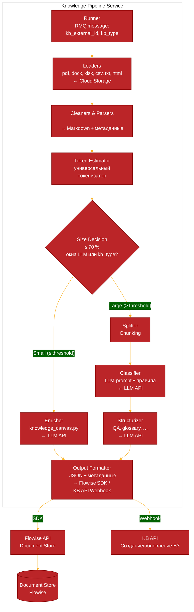

# Knowledge Pipeline

## Описание
Пайплайн обработки входных данных для формирования баз знаний

## Архитектура сервиса


### Последовательность конвейера
1. Загрузка (Load) — получаем сырой текст в Markdown.
2. Очистка (Clean) — удаляем технический мусор.
3. Оценка размера (Estimate tokens) — подсчитываем примерное количество токенов очищенного текста.

* Если токенов ≤ порога (например, 70% от контекстного окна LLM‑энричера) → идём по ветке «обогащение без разбиения».
* Если токенов > порога → стандартный путь с разбиением.

4. Ветка «Малый документ»

* LLM-энричмент (Enrich) — вызываем модель с промптом «Создай контекстное полотно знаний на основе документа».
На выходе получаем структурированный текст (можно JSON или расширенный Markdown), который вбирает все ключевые факты, связи, термины и является самодостаточным контекстом.
* Формирование выходного JSON — обогащённый документ снабжается метаданными и сразу отправляется в массив готовых объектов.

5. Ветка «Большой документ»

* Разбиение (Split) → Классификация (Classify) → Структурирование (Structure).
* Объединение и передача в Flowise — массив объектов (обогащённые цельные документы + структурированные чанки) отправляется в Document Store.

### Структура модулей
app/
├── loaders/
├── cleaners/
├── splitters/          # используется только для больших документов
├── classifier/         # только для больших документов
├── structurizers/      # только для больших документов
├── enricher/           # LLM-обогащение малых документов
│   └── knowledge_canvas.py
├── pipeline.py
├── config.py
└── utils/

### Подробное описание
За основу получения данных берем текущую версию API по приему файлов для формирования БЗ (Добавляется ветвление относительно размера контекста)
Конвейер данных для ВБЗ
1. Загрузка 
За основу форматов данных берем текущие форматы с которыми работает при формировании контекстной БЗ:
pdf, docx, xlsx, csv, txt, статьи (вебстраницы html)
Загрузка в основном осуществляется из облака cloud.infercom.one

Настройка и универсальность
Загрузчики строятся на универсальном классе, можно дописывать при необходимости появления новых форматов.

2. Парсинг (извлечение контента из данных) - очистка 
Pdf парсер изменяется на парсинг через локальную Gemma-4 (проверял, с этим она  справляется), остальные парсеры допиливаются для стабильной выдачи и унификации форматов. Все данные приводятся к формату Markdown + добавляются первичные метаданные (источник, дата, URL, категория данных - сейчас таблица, FAQ, glossary, document - статья). На выходе каждого документа набор сырых данных с метаразметкой. Также в процессе парсинга производится очистка от технического мусора (лишняя инфа в html например) 

Настройка и универсальность
Выходные данные парсеров строятся на базе универсальной схемы RawElement - структуру можно менять и перенастраивать. Каждый парсер в отдельном файле, подключается в общий пайплайн и используются универсальные методы (типа метода parse)

3. Оценка размера и ветвление
Используя универсальный токенизатор, подсчитываем примерное количество токенов в загруженных данных. Если токенов меньше порога (например 70% от контекстного окна используемой для контекстных баз LLM) - выбирается ветка создания контекстной базы данных (как сейчас в LK и API)
В другом случае выбирается ветка формирования ВБЗ.

Настройка и универсальность
Выбор модели и размера контекстного окна в переменных окружения.


#### Формирование ВБЗ

4. Разбиение (Split, Chunking) 
Нарезка больших текстов на логические блоки
на входе один RawElement - на выходе список RawElement с фрагментом данных 

Настройка и универсальность
Количество токенов - символов для разбиения

5. Классификация
Определиение информативен ли фрагмент и к какому типу он относится. Вызов LLM с промптом оценки фрагмента. Можно добавить правила на длину чанка. На выходе у чанка обновляется category, мусор отбрасывается

Настройка и универсальность
Можно использовать легковесную LLM, можно настраивать промпт. Промпт хранится в конфиге пайплайна в переменных окружения. Также там можно указывать длину отбрасываемых чанков. 

6. Структурирование 
Извлечение структурированных данных - например пар QA, определений из глоссария. Тут может быть LLM + регулярные выражения в зависимости от типа данных.

Настройка и универсальность
Возможность расширения типов полезных данных, настройки получения структурированных данных - промпты или регулярные выражения можно выносить в настройки пайплайна. 


7. Загрузка данных в DocStore Flowise
Загрузка конечного JSON в векторную базу данных через API Flowise.

После загрузки - получаем id DocStore Flowise, также можно делать запись в нашей бд для получения id бз для последующего использования в API. 

### Именование DocumentStore
#### Идентификация Document Store при загрузке через RMQ

Проблема: пайплайн должен знать, в какой именно Document Store загружать данные, независимо от того, создаётся он впервые или обновляется. Прямой передачи `document_store_id` в текущем контексте RMQ нет.

Решение: ввести внешний уникальный идентификатор базы знаний (`kb_external_id`), который передаётся в сообщении RMQ и однозначно определяет Document Store через его имя.

##### 1. Доработка контекста RMQ

Добавляем в JSON-сообщение поле `kb_external_id`:

```json
{
  "kb_external_id": "client123_project_abc",
  "kb_type": "auto",
  "files": { ... },
  "html": [ ... ],
  "text": "..."
}
```

Этот идентификатор:

- уникален в рамках всей системы,
- генерируется нашим бэкендом при первом создании базы знаний,
- сохраняется в наших метаданных (например, в БД заявки/проекта),
- при последующих обновлениях передаётся неизменным.

##### 2. Логика в пайплайне

```python
KB_NAME_PREFIX = "kb_"

async def get_or_create_document_store(flowise_client, kb_external_id: str) -> str:
    """
    Возвращает ID Document Store, создавая его при необходимости.
    Имя DS = kb_<external_id>.
    """
    ds_name = f"{KB_NAME_PREFIX}{kb_external_id}"
    # Пытаемся найти существующий
    existing = await flowise_client.find_document_store_by_name(ds_name)
    if existing:
        return existing["id"]
    # Создаём новый
    new_ds = await flowise_client.create_document_store(name=ds_name)
    return new_ds["id"]
```

Метод `run` пайплайна:

```python
async def run(self, message: dict) -> int:
    # 0. Получаем или создаём Document Store
    kb_external_id = message.get("kb_external_id")
    if not kb_external_id:
        raise ValueError("kb_external_id is required")
    ds_id = await get_or_create_document_store(self.flowise, kb_external_id)

    # 1. Загрузка документов
    raw_documents = await self._load_all_documents(message)
    ...

    # 4. Отправка в нужный Document Store
    await self.flowise.add_documents(ds_id, output_items)
```

`FlowiseDocumentStore` дополняется методами:

- `find_document_store_by_name(name) -> dict|None`
- `create_document_store(name) -> dict`

Оба работают через HTTP API Flowise.

##### 3. Как это соотносится с API продукта

Клиент (или внутренний сервис) при создании KB получает `external_id`:

- либо генерирует сам (например, UUID),
- либо получает от нас как часть ответа API.

Поле `title` из API может использоваться для человекочитаемого отображения, а `addition_fields` — для хранения `external_id` и других параметров.

При запросе на обновление KB клиент передаёт тот же `external_id` в `addition_fields`. Бэкенд помещает его в сообщение RMQ, и пайплайн находит тот же Document Store.

##### 4. Преимущества

- **Независимость от ID Flowise** – не нужно хранить и синхронизировать внутренние идентификаторы.
- **Устойчивость к пересозданию DS** – даже если Document Store удалили и создали заново, имя остаётся тем же, и поиск сработает.
- **Простота** – никаких дополнительных хранилищ маппингов, только детерминированное имя.
- **Гибкость** – `external_id` может включать идентификаторы клиента, проекта, типа KB, обеспечивая логическое группирование.

##### 5. Расширение на случай, если имя не уникально

Flowise **не требует** уникальности имени, можно сделать его уникальным, включив в `external_id` префикс клиента или UUID. Если потребуется несколько KB в рамках одного клиента, он сможет управлять ими через разные `external_id`.


## Деплой
Деплой настроен через .gitlab-ci.yml, Dockerfile-vendor, Dockerfile и docker-compose.yml

## Настройка и использование
### Параметры `settings` и их краткое описание  

| Параметр | Что описывает (кратко) |
|---|---|
| **ENV** | Текущее рабочее окружение (например, `dev`, `stage`, `prod`). |
| **STAGE_BASIC_AUTH_USER** | Имя пользователя HTTP‑Basic‑Auth для доступа к stage‑интерфейсу (pgAdmin). |
| **STAGE_BASIC_AUTH_PASS** | Пароль HTTP‑Basic‑Auth для доступа к stage‑интерфейсу. |
| **PROXY** | Прокси‑сервер (IP : порт), через который идут запросы (может быть `None`). |
| **MQ_HOST** | Хост RabbitMQ‑сервера. |
| **MQ_PORT** | Порт RabbitMQ‑сервера (может быть `None`). |
| **MQ_USER** | Пользователь для подключения к RabbitMQ. |
| **MQ_PASS** | Пароль для подключения к RabbitMQ. |
| **MQ_VIRTUAL_HOST** | Виртуальный хост RabbitMQ (по‑умолчанию `rabbit-vh`). |
| **MQ_EXCHANGE** | Имя exchange в RabbitMQ, формируется из префикса и `ENV`. |
| **GLOBAL_CONCURRENCY** | Глобальный лимит одновременных задач/потоков. |
| **CLIENT_WEIGHTS** | Весовой коэффициент для разных клиентов (словарь, напр. `{"client_a": 1, ...}`). |
| **DATABASE** | Строка подключения к основной базе данных. (не используется) |
| **OWNCLOUD_BASE_URL** | Базовый URL WebDAV‑доступа к OwnCloud. |
| **OWNCLOUD_USER** | Имя пользователя OwnCloud. |
| **OWNCLOUD_PASSWORD** | Пароль пользователя OwnCloud. |
| **LOCAL_PATH** | Локальная директория для временных файлов. |
| **VLM_API_PROVIDER** | Провайдер локальной VLM‑модели (например, `Infercom`). |
| **VLM_API_URL** | URL‑endpoint локальной VLM‑модели. |
| **VLM_API_KEY** | Ключ доступа к VLM‑модели (может быть `not‑needed` для локальной модели). |
| **VLM_MODEL_NAME** | Наименование модели VLM (например, `gemma-4-31B-q8-it-GGUF`). |
| **VLM_PROMPT_TEMPLATE** | Шаблон промпта, используемый при запросах к VLM. |
| **VLM_TIMEOUT** | Таймаут (сек) ожидания ответа от VLM. |
| **MAX_CONCURRENT_PDFS** | Максимальное количество PDF‑файлов, обрабатываемых одновременно. |
| **MAX_CKB_TOKENS** | Верхний предел токенов для контекстной базы знаний. |
| **ENRICHER_API_URL** | URL‑endpoint сервиса Enricher (обогащение контекста). |
| **ENRICHER_API_KEY** | Ключ доступа к Enricher (может быть `not‑needed` для локальной модели). |
| **ENRICHER_MODEL_NAME** | Наименование модели, используемой Enricher‑ом. |
| **ENRICHER_PROMPT** | Полный промпт, отправляемый в Enricher для генерации JSON‑БЗ. |
| **CLASSIFIER_API_URL** | URL‑endpoint классификатора (LLM‑модель). |
| **CLASSIFIER_API_KEY** | Ключ доступа к классификатору (может быть `not‑needed` для локальной модели). |
| **CLASSIFIER_MODEL_NAME** | Наименование модели классификатора. |
| **CLASSIFIER_PROMPT_TEMPLATE** | Шаблон промпта, используемый классификатором для оценки фрагмента текста. |
| **CLASSIFIER_CATEGORY_DESCRIPTIONS** | Словарь описаний возможных категорий (`faq`, `glossary`, …). |
| **CLASSIFIER_TRASH_SIZE** | Пороговый размер «мусорных» фрагментов (по‑умолчанию 0). |
| **LLM_STRUCT** | Параметр, отвечающий за структуру LLM‑модели (пока пустой). |
| **FLOWISE_API_URL** | URL‑endpoint API Flowise. |
| **FLOWISE_API_KEY** | Ключ доступа к Flowise (создается во Flowise UI). |
| **LOADER_NAME** | Наименование загрузчика (loader) для Document Store (по‑умолчанию `jsonFile`). |
| **LOADER_CONFIG** | Конфигурация загрузчика (словарь, может быть пустым). |
| **EMBEDDING_PROVIDER** | Провайдер эмбеддингов (например, `huggingFaceInferenceEmbeddings`). |
| **EMBEDDING_API_URL** | URL‑endpoint сервиса эмбеддингов. |
| **EMBEDDING_MODEL** | Наименование модели эмбеддингов (например, `Qwen/Qwen3-Embedding-8B`). |
| **EMBEDDING_CREDENTIAL** | UUID ключа доступа к сервису эмбеддингов. (Получается из API Flowise после создания Credential) |
| **VECTOR_STORE_PROVIDER** | Провайдер векторного хранилища (по‑умолчанию `postgres`). |
| **VECTOR_STORE_HOST** | Хост векторного хранилища. |
| **VECTOR_STORE_PORT** | Порт векторного хранилища. |
| **VECTOR_STORE_CREDENTIAL** | UUID ключа доступа к векторному хранилищу. (Получается из API Flowise после создания Credential) |
| **VECTOR_STORE_DATABASE** | Имя базы данных векторного хранилища. |
| **VECTOR_STORE_TOPK** | Количество ближайших соседей (top‑k) при поиске в векторном хранилище. |
| **RECORD_MANAGER_PROVIDER** | Провайдер менеджера записей (по‑умолчанию `postgres`). |
| **RECORD_MANAGER_HOST** | Хост менеджера записей. |
| **RECORD_MANAGER_PORT** | Порт менеджера записей. |
| **RECORD_MANAGER_CREDENTIAL** | UUID ключа доступа к менеджеру записей. (Получается из API Flowise после создания Credential) |
| **RECORD_MANAGER_DATABASE** | Имя базы данных менеджера записей. |


## Тестирование
{
  "id": 101,
  "job_id": 1023,
  "kb_type": "vector",
  "kb_external_id": "client123_project_abc",
  "data": {
    "docx": [
      "https://cloud.infercom.one/remote.php/webdav/test/knowledge_pipeline/test_kolobok.docx"
    ]
  },
  "external_url": "https://webhook.site/f1f3e740-6e86-4a11-a378-5a4b0fa9f4a9"
}