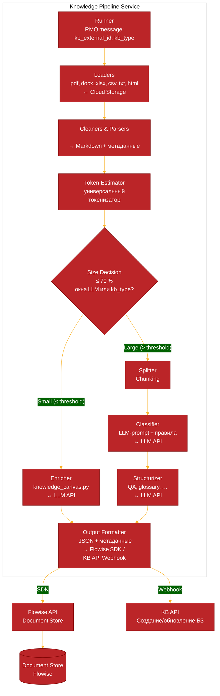

# Knowledge Pipeline

## Описание
Пайплайн обработки входных данных для формирования баз знаний

## Архитектура сервиса


### Последовательность конвейера
1. Загрузка (Load) — получаем сырой текст в Markdown.
2. Очистка (Clean) — удаляем технический мусор.
3. Оценка размера (Estimate tokens) — подсчитываем примерное количество токенов очищенного текста.

* Если токенов ≤ порога (например, 70% от контекстного окна LLM‑энричера) → идём по ветке «обогащение без разбиения».
* Если токенов > порога → стандартный путь с разбиением.

4. Ветка «Малый документ»

* LLM-энричмент (Enrich) — вызываем модель с промптом «Создай контекстное полотно знаний на основе документа».
На выходе получаем структурированный текст (можно JSON или расширенный Markdown), который вбирает все ключевые факты, связи, термины и является самодостаточным контекстом.
* Формирование выходного JSON — обогащённый документ снабжается метаданными и сразу отправляется в массив готовых объектов.

5. Ветка «Большой документ»

* Разбиение (Split) → Классификация (Classify) → Структурирование (Structure).
* Объединение и передача в Flowise — массив объектов (обогащённые цельные документы + структурированные чанки) отправляется в Document Store.

### Структура модулей
know_everything_ai/
├── __main__.py        # entrypoint: python -m know_everything_ai
├── loaders/           # pdf, docx, xlsx/csv, txt, html
├── cleaners/          # очистка текста
├── parsers/           # парсинг PDF (VLM) и HTML → Markdown
├── splitters/         # используется только для больших документов
├── classifier/        # только для больших документов
├── structurizers/     # только для больших документов
├── enricher/          # LLM-обогащение малых документов
│   └── knowledge_canvas.py
├── flowise/           # async-клиент Document Store
├── transports/        # rabbitmq: приём заданий, webhook, ретраи
├── ui/                # стенд Streamlit (app.py) — инструмент разработчика
├── pipeline.py        # оценка токенов и ветвление
├── settings.py        # конфигурация из переменных окружения
└── utils/             # модели, токенизатор, логирование

### Подробное описание
За основу получения данных берем текущую версию API по приему файлов для формирования БЗ (Добавляется ветвление относительно размера контекста)
Конвейер данных для ВБЗ
1. Загрузка 
За основу форматов данных берем текущие форматы с которыми работает при формировании контекстной БЗ:
pdf, docx, xlsx, csv, txt, статьи (вебстраницы html)
Загрузка в основном осуществляется из вашего хранилища: публичные URL, WebDAV-монтирование или локальные файлы.

Настройка и универсальность
Загрузчики строятся на универсальном классе, можно дописывать при необходимости появления новых форматов.

2. Парсинг (извлечение контента из данных) - очистка 
Pdf парсер изменяется на парсинг через локальную Gemma-4 (проверял, с этим она  справляется), остальные парсеры допиливаются для стабильной выдачи и унификации форматов. Все данные приводятся к формату Markdown + добавляются первичные метаданные (источник, дата, URL, категория данных - сейчас таблица, FAQ, glossary, document - статья). На выходе каждого документа набор сырых данных с метаразметкой. Также в процессе парсинга производится очистка от технического мусора (лишняя инфа в html например) 

Настройка и универсальность
Выходные данные парсеров строятся на базе универсальной схемы RawElement - структуру можно менять и перенастраивать. Каждый парсер в отдельном файле, подключается в общий пайплайн и используются универсальные методы (типа метода parse)

3. Оценка размера и ветвление
Используя универсальный токенизатор, подсчитываем примерное количество токенов в загруженных данных. Если токенов меньше порога (например 70% от контекстного окна используемой для контекстных баз LLM) - выбирается ветка создания контекстной базы данных (как сейчас в LK и API)
В другом случае выбирается ветка формирования ВБЗ.

Настройка и универсальность
Выбор модели и размера контекстного окна в переменных окружения.


#### Формирование ВБЗ

4. Разбиение (Split, Chunking) 
Нарезка больших текстов на логические блоки
на входе один RawElement - на выходе список RawElement с фрагментом данных 

Настройка и универсальность
Количество токенов - символов для разбиения

5. Классификация
Определиение информативен ли фрагмент и к какому типу он относится. Вызов LLM с промптом оценки фрагмента. Можно добавить правила на длину чанка. На выходе у чанка обновляется category, мусор отбрасывается

Настройка и универсальность
Можно использовать легковесную LLM, можно настраивать промпт. Промпт хранится в конфиге пайплайна в переменных окружения. Также там можно указывать длину отбрасываемых чанков. 

6. Структурирование 
Извлечение структурированных данных - например пар QA, определений из глоссария. Тут может быть LLM + регулярные выражения в зависимости от типа данных.

Настройка и универсальность
Возможность расширения типов полезных данных, настройки получения структурированных данных - промпты или регулярные выражения можно выносить в настройки пайплайна. 


7. Загрузка данных в DocStore Flowise
Загрузка конечного JSON в векторную базу данных через API Flowise.

После загрузки - получаем id DocStore Flowise, также можно делать запись в нашей бд для получения id бз для последующего использования в API. 

### Именование DocumentStore
#### Идентификация Document Store при загрузке через RMQ

Проблема: пайплайн должен знать, в какой именно Document Store загружать данные, независимо от того, создаётся он впервые или обновляется. Прямой передачи `document_store_id` в текущем контексте RMQ нет.

Решение: ввести внешний уникальный идентификатор базы знаний (`kb_external_id`), который передаётся в сообщении RMQ и однозначно определяет Document Store через его имя.

##### 1. Доработка контекста RMQ

Добавляем в JSON-сообщение поле `kb_external_id`:

```json
{
  "kb_external_id": "client123_project_abc",
  "kb_type": "auto",
  "files": { ... },
  "html": [ ... ],
  "text": "..."
}
```

Этот идентификатор:

- уникален в рамках всей системы,
- генерируется нашим бэкендом при первом создании базы знаний,
- сохраняется в наших метаданных (например, в БД заявки/проекта),
- при последующих обновлениях передаётся неизменным.

##### 2. Логика в пайплайне

```python
KB_NAME_PREFIX = "kb_"

async def get_or_create_document_store(flowise_client, kb_external_id: str) -> str:
    """
    Возвращает ID Document Store, создавая его при необходимости.
    Имя DS = kb_<external_id>.
    """
    ds_name = f"{KB_NAME_PREFIX}{kb_external_id}"
    # Пытаемся найти существующий
    existing = await flowise_client.find_document_store_by_name(ds_name)
    if existing:
        return existing["id"]
    # Создаём новый
    new_ds = await flowise_client.create_document_store(name=ds_name)
    return new_ds["id"]
```

Метод `run` пайплайна:

```python
async def run(self, message: dict) -> int:
    # 0. Получаем или создаём Document Store
    kb_external_id = message.get("kb_external_id")
    if not kb_external_id:
        raise ValueError("kb_external_id is required")
    ds_id = await get_or_create_document_store(self.flowise, kb_external_id)

    # 1. Загрузка документов
    raw_documents = await self._load_all_documents(message)
    ...

    # 4. Отправка в нужный Document Store
    await self.flowise.add_documents(ds_id, output_items)
```

`FlowiseDocumentStore` дополняется методами:

- `find_document_store_by_name(name) -> dict|None`
- `create_document_store(name) -> dict`

Оба работают через HTTP API Flowise.

##### 3. Как это соотносится с API продукта

Клиент (или внутренний сервис) при создании KB получает `external_id`:

- либо генерирует сам (например, UUID),
- либо получает от нас как часть ответа API.

Поле `title` из API может использоваться для человекочитаемого отображения, а `addition_fields` — для хранения `external_id` и других параметров.

При запросе на обновление KB клиент передаёт тот же `external_id` в `addition_fields`. Бэкенд помещает его в сообщение RMQ, и пайплайн находит тот же Document Store.

##### 4. Преимущества

- **Независимость от ID Flowise** – не нужно хранить и синхронизировать внутренние идентификаторы.
- **Устойчивость к пересозданию DS** – даже если Document Store удалили и создали заново, имя остаётся тем же, и поиск сработает.
- **Простота** – никаких дополнительных хранилищ маппингов, только детерминированное имя.
- **Гибкость** – `external_id` может включать идентификаторы клиента, проекта, типа KB, обеспечивая логическое группирование.

##### 5. Расширение на случай, если имя не уникально

Flowise **не требует** уникальности имени, можно сделать его уникальным, включив в `external_id` префикс клиента или UUID. Если потребуется несколько KB в рамках одного клиента, он сможет управлять ими через разные `external_id`.


## Деплой
Деплой настроен через .gitlab-ci.yml, Dockerfile-vendor, Dockerfile и docker-compose.yml

## Настройка и использование
### Параметры `settings` и их краткое описание  

| Параметр | Что описывает (кратко) |
|---|---|
| **ENV** | Текущее рабочее окружение (например, `dev`, `stage`, `prod`). |
| **STAGE_BASIC_AUTH_USER** | Имя пользователя HTTP‑Basic‑Auth для доступа к stage‑интерфейсу (pgAdmin). |
| **STAGE_BASIC_AUTH_PASS** | Пароль HTTP‑Basic‑Auth для доступа к stage‑интерфейсу. |
| **PROXY** | Прокси‑сервер (IP : порт), через который идут запросы (может быть `None`). |
| **MQ_HOST** | Хост RabbitMQ‑сервера. |
| **MQ_PORT** | Порт RabbitMQ‑сервера (может быть `None`). |
| **MQ_USER** | Пользователь для подключения к RabbitMQ. |
| **MQ_PASS** | Пароль для подключения к RabbitMQ. |
| **MQ_VIRTUAL_HOST** | Виртуальный хост RabbitMQ (по‑умолчанию `rabbit-vh`). |
| **MQ_EXCHANGE** | Имя exchange в RabbitMQ, формируется из префикса и `ENV`. |
| **GLOBAL_CONCURRENCY** | Глобальный лимит одновременных задач/потоков. |
| **CLIENT_WEIGHTS** | Весовой коэффициент для разных клиентов (словарь, напр. `{"client_a": 1, ...}`). |
| **DATABASE** | Строка подключения к основной базе данных. (не используется) |
| **WEBDAV_BASE_URL** | Базовый URL WebDAV‑доступа (Nextcloud, ownCloud и т.п.). Пусто — отключено. |
| **WEBDAV_USER** | Имя пользователя WebDAV. |
| **WEBDAV_PASSWORD** | Пароль пользователя WebDAV. |
| **DATA_DIR** | Каталог для данных и временных файлов. |
| **VLM_API_URL** | URL‑endpoint локальной VLM‑модели. |
| **VLM_API_KEY** | Ключ доступа к VLM‑модели (может быть `not‑needed` для локальной модели). |
| **VLM_MODEL_NAME** | Наименование модели VLM (например, `gemma-4-31B-q8-it-GGUF`). |
| **VLM_PROMPT_TEMPLATE** | Шаблон промпта, используемый при запросах к VLM. |
| **VLM_TIMEOUT** | Таймаут (сек) ожидания ответа от VLM. |
| **MAX_CONCURRENT_PDFS** | Максимальное количество PDF‑файлов, обрабатываемых одновременно. |
| **MAX_CKB_TOKENS** | Верхний предел токенов для контекстной базы знаний. |
| **ENRICHER_FALLBACK_API_URL** | Запасной endpoint Enricher; пусто — роль работает только на основном. |
| **ENRICHER_FALLBACK_API_KEY** | Ключ запасного endpoint Enricher. |
| **ENRICHER_FALLBACK_MODEL_NAME** | Модель запасного endpoint Enricher; требует заполненного URL. |
| **CLASSIFIER_FALLBACK_API_URL** | Запасной endpoint Classifier. |
| **CLASSIFIER_FALLBACK_API_KEY** | Ключ запасного endpoint Classifier. |
| **CLASSIFIER_FALLBACK_MODEL_NAME** | Модель запасного endpoint Classifier; требует заполненного URL. |
| **VLM_FALLBACK_API_URL** | Запасной endpoint VLM. |
| **VLM_FALLBACK_API_KEY** | Ключ запасного endpoint VLM. |
| **VLM_FALLBACK_MODEL_NAME** | Модель запасного endpoint VLM; требует заполненного URL. |
| **ENRICHER_API_URL** | URL‑endpoint сервиса Enricher (обогащение контекста). |
| **ENRICHER_API_KEY** | Ключ доступа к Enricher (может быть `not‑needed` для локальной модели). |
| **ENRICHER_MODEL_NAME** | Наименование модели, используемой Enricher‑ом. |
| **ENRICHER_PROMPT** | Полный промпт, отправляемый в Enricher для генерации JSON‑БЗ. |
| **CLASSIFIER_API_URL** | URL‑endpoint классификатора (LLM‑модель). |
| **CLASSIFIER_API_KEY** | Ключ доступа к классификатору (может быть `not‑needed` для локальной модели). |
| **CLASSIFIER_MODEL_NAME** | Наименование модели классификатора. |
| **CLASSIFIER_PROMPT_TEMPLATE** | Шаблон промпта, используемый классификатором для оценки фрагмента текста. |
| **CLASSIFIER_CATEGORY_DESCRIPTIONS** | Словарь описаний возможных категорий (`faq`, `glossary`, …). |
| **CLASSIFIER_TRASH_SIZE** | Пороговый размер «мусорных» фрагментов (по‑умолчанию 0). |
| **LLM_STRUCT** | Параметр, отвечающий за структуру LLM‑модели (пока пустой). |
| **FLOWISE_API_URL** | URL‑endpoint API Flowise. |
| **FLOWISE_API_KEY** | Ключ доступа к Flowise (создается во Flowise UI). |
| **LOADER_NAME** | Наименование загрузчика (loader) для Document Store (по‑умолчанию `jsonFile`). |
| **LOADER_CONFIG** | Конфигурация загрузчика (словарь, может быть пустым). |
| **EMBEDDING_PROVIDER** | Провайдер эмбеддингов (например, `huggingFaceInferenceEmbeddings`). |
| **EMBEDDING_API_URL** | URL‑endpoint сервиса эмбеддингов. |
| **EMBEDDING_MODEL** | Наименование модели эмбеддингов (например, `Qwen/Qwen3-Embedding-8B`). |
| **EMBEDDING_CREDENTIAL** | UUID ключа доступа к сервису эмбеддингов. (Получается из API Flowise после создания Credential) |
| **VECTOR_STORE_PROVIDER** | Провайдер векторного хранилища (по‑умолчанию `postgres`). |
| **VECTOR_STORE_HOST** | Хост векторного хранилища. Используется и нашим pgvector‑слоем, не только Flowise. |
| **VECTOR_STORE_PORT** | Порт векторного хранилища. |
| **VECTOR_STORE_USER** | Пользователь БД для нашего pgvector‑слоя (по умолчанию `postgres`). |
| **VECTOR_STORE_CREDENTIAL** | Пароль БД. (Получается из API Flowise при настройке Credential, у нас — пароль Postgres) |
| **VECTOR_STORE_DATABASE** | Имя базы данных векторного хранилища. |
| **FLOWISE_ENABLED** | `false` — пайплайн работает без Flowise: `document_store_id` не запрашивается, `text_out` = id записи в нашем реестре. |
| **LOCAL_EMBEDDING_MODEL** | Модель локального эмбеддера fastembed (ONNX, без GPU и без API). |
| **LOCAL_EMBEDDING_DIM** | Размерность вектора. Зашита в тип колонки `vector(...)` при миграции: несовпадение — ошибка, а не тихое падение качества. |
| **LOCAL_EMBEDDING_BATCH_SIZE** | Размер батча эмбеддингов. |
| **LOCAL_EMBEDDING_QUERY_PREFIX** / **LOCAL_EMBEDDING_DOC_PREFIX** | Префиксы в стиле `query:` / `passage:` для семейства e5. Для дефолтного MiniLM пустые; для e5 обязательны. |
| **FASTEMBED_CACHE_DIR** | Каталог весов. Пусто — дефолтный кэш fastembed; в контейнере указывается на том (`fastembed_cache`), иначе веса качаются при каждом старте. |
| **CHUNK_SIZE_TOKENS** | Размер секции/чанка в токенах (по умолчанию 800). Для эмбеддингов это значение пока больше 512‑токенного окна дефолтной MiniLM, и длинный хвост обрезается молча — при смене модели на e5‑large либо уменьшить размер, либо смириться с усечением. |
| **CHUNK_OVERLAP_TOKENS** | Перекрытие при дотягивании длинных секций. |
| **VECTOR_STORE_TOPK** | Количество ближайших соседей (top‑k) при поиске в векторном хранилище. |
| **QUERY_API_HOST** | Хост, на котором слушает query API (дефолт `0.0.0.0`). |
| **QUERY_API_PORT** | Порт query API. В compose пробрасывается на `http://localhost:8000`. |
| **QUERY_MAX_LIMIT** | Потолок `limit` в запросе. Значение свыше потолка не отклоняется (422), а усекается до лучшего результата. |
| **QUERY_MIN_SCORE** | Нижний порог cosine‑оценки фрагмента. `-1.0` (дефолт) — фильтрация выключена; `0.0` молча отбрасывает «противоположные» фрагменты, поэтому не дефолт. |
| **QUERY_API_KEY_CACHE_SECONDS** | Срок жизни положительной проверки ключа в памяти. Отзыв ключа действует в пределах этого окна. |
| **ANSWER_API_URL** / **ANSWER_API_KEY** | Провайдер роли `answer` (chat‑completions, как и остальные роли). Опциональная: retrieval работает без неё, `/chat` отвечает 503, пока не задана. |
| **ANSWER_MODEL_NAME** | Модель ответов (дефолт `glm-5.3-flash`). |
| **ANSWER_SYSTEM_PROMPT** | Промпт агента. Дефолт — константа `ANSWER_PROMPT` в `prompts.py`: отвечаем строго по фрагментам, цитируем `[n]`, честно признаём отсутствие ответа. |
| **ANSWER_TIMEOUT** | Таймаут на один ответ (дефолт 120 c). |
| **ANSWER_MAX_TOKENS** | Потолок завершения ответа (дефолт 1200; `None` — без ограничения). |
| **ANSWER_TEMPERATURE** | Температура ответов (дефолт `0.2`). |
| **ANSWER_MAX_FRAGMENTS** | Сколько фрагментов цитирует один ответ (дефолт 6). SSE‑эндпоинт берёт минимум из запроса и этого потолка. |
| **ANSWER_FALLBACK_API_URL** / **ANSWER_FALLBACK_API_KEY** / **ANSWER_FALLBACK_MODEL_NAME** | Фолбек роли `answer`, та же контрактная пара URL/модель, что у остальных ролей. |
| **RECORD_MANAGER_PROVIDER** | Провайдер менеджера записей (по‑умолчанию `postgres`). |
| **RECORD_MANAGER_HOST** | Хост менеджера записей. |
| **RECORD_MANAGER_PORT** | Порт менеджера записей. |
| **RECORD_MANAGER_CREDENTIAL** | UUID ключа доступа к менеджеру записей. (Получается из API Flowise после создания Credential) |
| **RECORD_MANAGER_DATABASE** | Имя базы данных менеджера записей. |


## Собственное хранилище: Postgres + pgvector

Read‑слой (P2) написан в нашем коде и не зависит от Flowise. Миграции — простые
SQL‑файлы из `migrations/`, применяются командой:

```bash
python -m know_everything_ai migrate
```

Повторный запуск ничего не делает (таблица `schema_migrations`), каждый файл —
в отдельной транзакции. Та же команда выполняется автоматически перед стартом
воркера (`python -m know_everything_ai serve`). Расхождение `LOCAL_EMBEDDING_DIM`
с колонкой `vector(...)` в БД или смена модели эмбеддинга в `embedding_state`
завершают миграцию ошибкой: векторы пришлось бы пересчитывать целиком.

| Таблица | Назначение |
|---|---|
| `knowledge_bases` | Реестр баз: ветка, статус, причина, `canvas_tokens`, эстиматор/порог, `payload_id`, `job_id`, `document_store_id`, размер, `canvas`. |
| `chunks` | Векторы + исходный текст и метаданные, индекс HNSW (cosine), каскадный `kb_id`. |
| `api_keys` | SHA‑256 ключей для RAG‑API. |
| `embedding_state` | Какая модель и размерность уже использовались. |

Обе ветки пишут сюда:

* **context** — canvas парсится в JSON (с фолбэком «весь canvas одной
  секцией»), режется по верхнеуровневым ключам: каждый элемент списка —
  отдельная секция; секции длиннее `CHUNK_SIZE_TOKENS` дотягиваются с
  перекрытием. Нарезка идёт по структуре документа, а не по сырому тексту;
* **vector** — прошедшие классификатор фрагменты идут в `chunks` напрямую.

`text_out` в обоих случаях — `str(id)` записи в `knowledge_bases`; там же
лежит `document_store_id` Flowise, если `FLOWISE_ENABLED=true`.

Веса эмбеддинга лежат в томе `fastembed_cache`, а не на хосте.

## Query API (read side)

Retrieval-поверхность поверх реестра и `chunks`: ранжирует и отдаёт фрагменты,
но никогда не тратит токены модели — ответы на вопросы это агент (секция «Чат»
ниже). Образ `api` из Dockerfile, сервис `query_api` в compose, порт по
умолчанию `8000`.

Старт валидируется по роли `api`: модели-роли (`ENRICHER_*`, `CLASSIFIER_*`,
`VLM_*`) процессу не нужны, и их отсутствие не должно удерживать read-реплику.
Как и воркер, API применяет миграции перед стартом.

Доступ — Bearer-ключи из таблицы `api_keys` (хранится только SHA‑256, открытый
текст не пишется нигде). Выпуск через CLI:

```bash
python -m know_everything_ai apikey create --name portal
# id=1
# name=portal
# key=kp_xxxxxxxxxxxxxxxxxxxxxxxxxxxxxxxxxxxxxxxxxxx
```

Ключ печатается один раз и не восстанавливается; `apikey list` и
`apikey revoke --id 1` — остальные операции. Отзыв действует в пределах
`QUERY_API_KEY_CACHE_SECONDS`.

Запрос:

```bash
curl -s http://localhost:8000/v1/knowledge-bases/acme_project_abc/query \
  -H "Authorization: Bearer kp_..." \
  -H "Content-Type: application/json" \
  -d '{"query":"как задеплоить?","limit":10}'
```

* 401 — нет ключа или он отозван; 404 — базы нет в реестре; 409 — база ещё не
  готова (`pending`) либо упала (`failed`), отвечать из её фрагментов нельзя.
  Мониторинг: `/healthz` (жив) и `/readyz` (реестр отвечает).
* `limit` в запросе усекается до `QUERY_MAX_LIMIT`; `min_score` сужает
  серверный `QUERY_MIN_SCORE`.
* `GET /v1/knowledge-bases` — реестр без canvas (он мегабайтный);
  `GET /v1/knowledge-bases/{id}` — с `chunk_count`;
  `GET /v1/knowledge-bases/{id}/export` — все фрагменты документа.

Ответ `query`: `branch`, `score_floor`, `hit_count`, `took_ms`, `model`,
`hits[]`, где каждый hit — `chunk_id`, `content`, `score`, `category`, `source`,
`title`, `metadata`.

{
  "id": 101,
  "job_id": 1023,
  "kb_type": "vector",
  "kb_external_id": "client123_project_abc",
  "data": {
    "docx": [
      "https://dav.example.com/files/knowledge/test_kolobok.docx"
    ]
  },
"external_url": "https://webhook.site/f1f3e740-6e86-4a11-a378-5a4b0fa9f4a9"
}
---

## Чат (агент ответов)

Отвечает по найденным фрагментам и тратит токены модели только когда клиент
явно попросил ответ. Роль `answer` (настройки `ANSWER_*`) — отдельная от
извлечения: `glm-5.3-flash` по умолчанию, свой промпт (цитирование `[n]`,
честное «в базе нет ответа»), свой фолбек. Без неё retrieval-эндпоинты работают,
а `/chat` отвечает `503`.

```bash
curl -sN http://localhost:8000/v1/knowledge-bases/acme_project_abc/chat \
  -H "Authorization: Bearer kp_..." \
  -H "Content-Type: application/json" \
  -d '{"question":"как задеплоить?","limit":6}'
```

Ответ — Server‑Sent Events (`text/event-stream`); каждое событие — строка
`event: <kind>` + `data: <json>`:

1. `sources` — найденные фрагменты и то, что с ними делали (`kb_external_id`,
   `branch`, `model`, `floor`, `retrieval_took_ms`, `hits[]`);
2. `delta` — по одному на кусок текста ответа, конкатенация и есть ответ;
3. `done` — `hit_count`, `text_len`, `took_ms`, `usage` (токены только этого
   ответа);
4. `error` — вместо `done`, если модель упала после первого токена: клиент
   показывает частичный ответ и кнопку «ещё раз», а не «сеть умерла».

Если фрагментов нет, модель не вызывается: поток сразу отдаёт `sources` с
пустым `hits[]`, дельта «В базе знаний пока нет данных по этому вопросу» и
`done` с пустым `usage`. Ошибки до начала стрима — настоящие HTTP‑статусы:
`404` базы нет, `409` не готова.

Тот же поток (`sources → delta → done`) использует вкладка **Чат** в Streamlit
(`ui/app.py`): выбор `kb_external_id`, вопрос и part-by-part рендер. Если
`ANSWER_*` не заданы, вкладка показывает найденные фрагменты как «ответ без
модели» вместо того чтобы мёртво упасть.

## Панель «Базы знаний» (общая для вкладок)

Обе вкладки (`Пайплайн` и `Чат`) используют одну панель **«Базы знаний»**:
список того, что реально лежит во встроенном хранилище (registry + векторный
store) — `kb_external_id`, ветка, статус, число элементов/чанков. Выбор в этой
панели подставляется в оба поля `kb_external_id`, так что база, созданная в
«Пайплайн», сразу видна и уже выбрана в «Чате» при переключении режимов.

`run_preview` в песочнице не пишет в хранилище (именно это и «прятало» базу при
переключении режимов) — запись делается явной кнопкой **«3. Сохранить в базу
знаний (для „Чата")»**, которая разбирает результат на чанки и пишет их во
встроенный store (для `context`-ветки — те же `canvas_to_chunks`, что у воркера).
После неё база появляется в панели и становится доступна `/chat` и вкладке
«Чат». Кнопка «4. Записать в Flowise Document Store» остаётся отдельным шагом и
видна только при `FLOWISE_ENABLED=true`.

## Локальный стенд

Полный цикл без Flowise и без вебхука покупателя: z.ai как модельный провайдер,
RabbitMQ как транспорт, локальный приёмник вебхуков вместо сервера клиента.

```bash
cp .env.example .env      # заполнить API-ключи провайдера
python tools/make_russian_pdf.py            # тестовый PDF с кириллицей

docker compose -f docker-compose.yml -f docker-compose.stand.yml up -d

docker compose exec rabbitmq rabbitmqadmin publish \
  exchange=dev_knowledge_base_tasks routing_key=acme \
  payload='{"id":1,"job_id":1001,"kb_type":"context","kb_external_id":"acme_project_abc","data":"http://files/sample_ru.pdf","external_url":"http://webhook_sink/hook"}'

docker compose logs -f webhook_sink        # здесь появится результат
```

`docker-compose.stand.yml` добавляет сервисы для локальной разработки и намеренно
вынесен из поставляемого `docker-compose.yml`:

* `webhook_sink` — принимает `ReturnPayload` и печатает его в лог и в
  `logs/webhook/`;
* `files` — раздаёт `./data`, чтобы источником был настоящий http-URL, который
  воркер скачает сам;
* `ui` — стенд на Streamlit (см. ниже);
* `ollama` — локальные модели как запасной провайдер (см. ниже).

Аргументы очередей — часть контракта RabbitMQ: брокер сравнивает их с уже
существующей очередью и закрывает канал с `PRECONDITION_FAILED`, если они
разошлись. Поэтому при обновлении, которое меняет аргументы (например,
появление `x-consumer-timeout`), очереди на живом стенде нужно удалить —
воркер создаст их заново:

```bash
docker compose stop pipeline_worker
docker compose exec rabbitmq rabbitmqctl delete_queue dev_knowledge_base_tasks.acme
docker compose exec rabbitmq rabbitmqctl delete_queue dev_knowledge_base_tasks.acme.retry.1
docker compose exec rabbitmq rabbitmqctl delete_queue dev_knowledge_base_tasks.acme.retry.2
docker compose up -d pipeline_worker
```


Для `kb_type: "context"` Flowise не нужен вовсе: он задействован только в ветке
`vector`. В `.env` для стенда поэтому достаточно `FLOWISE_ENABLED=false`,
`ALLOW_PRIVATE_URLS=true` (внутренние хосты compose блокирует SSRF-guard) и
одного API-ключа модели.

Провайдер z.ai подходит без правок кода — он совместим с протоколом OpenAI:

```bash
ENRICHER_API_URL=https://api.z.ai/api/paas/v4
CLASSIFIER_API_URL=https://api.z.ai/api/paas/v4
VLM_API_URL=https://api.z.ai/api/paas/v4
ENRICHER_MODEL_NAME=glm-5.3
CLASSIFIER_MODEL_NAME=glm-5.3
VLM_MODEL_NAME=glm-5.3-flash      # текстовые модели glm-5.3 картинки не видят
```

Остановить стенд: `docker compose -f docker-compose.yml -f docker-compose.stand.yml down -v`

Опубликовать job с хоста, не заходя внутрь контейнера:

```bash
.venv/Scripts/python.exe tools/publish_job.py --id 1005
```

## Отказоустойчивость: локальный Ollama как второй провайдер

Каждая роль — `ENRICHER`, `CLASSIFIER`, `VLM` — принимает необязательную пару
«запасной» настроек. При **временной** ошибке основного провайдера (429, таймаут,
разрыв соединения, 5xx) вызов уходит на запасной, а не падает. Ошибка 400 или 401
сразу бросается наружу: это ошибка конфигурации, и другой провайдер её только
воспроизведёт.

Обычно запасной провайдер — локальный Ollama: без квот и без оплаты за токены.

```bash
docker compose -f docker-compose.yml -f docker-compose.stand.yml up -d ollama
docker compose -f docker-compose.yml -f docker-compose.stand.yml \
  exec ollama ollama pull qwen3:1.7b
```

```bash
# .env — внутри compose-сети Ollama доступен как http://ollama:11434/v1
ENRICHER_FALLBACK_API_URL=http://ollama:11434/v1
ENRICHER_FALLBACK_API_KEY=not-needed
ENRICHER_FALLBACK_MODEL_NAME=qwen3:1.7b

CLASSIFIER_FALLBACK_API_URL=http://ollama:11434/v1
CLASSIFIER_FALLBACK_API_KEY=not-needed
CLASSIFIER_FALLBACK_MODEL_NAME=qwen3:1.7b
```

Модель задаётся вместе с URL: имя без URL отвергается при старте, иначе
отказоустойчивость выглядела бы настроенной, но не срабатывала бы ровно тогда,
когда понадобилась.

Проверить переключение без правки `.env` — dead primary и живой Ollama:

```bash
.venv/Scripts/python.exe tools/smoke_failover.py
```

Что стоит понимать про поведение:

* Переключение **прилипает** к сообщению. Как только основной провайдер упал
  один раз, остальные вызовы этого сообщения идут на запасной — иначе каждая
  страница заново ждала бы таймаута. К следующему сообщению предпочтение
  сбрасывается, поэтому оживший провайдер забирается обратно без перезапуска.
* Локальная модель отвечает и во время плановых ограничений, а не только при
  аварии, и она меньше платной. Поэтому качество может упасть на остаток job'а.
* У локальной модели меньше контекстного окна, поэтому под неё нужно опустить
  `MAX_CKB_TOKENS` (около 24 000), `PDF_MAX_PAGES_PER_REQUEST` (2–4) и
  `PDF_RENDER_DPI` (150). Иначе запрос потребует от неё больше, чем она удержит.
* Docker Desktop на 16 ГБ-машине отдаёт всему стенду ~7.6 ГБ, из которых Streamlit
  занимает около 2.6 ГБ. Под 4B-модель места не хватает: либо поднять лимит
  памяти Docker, либо запустить Ollama нативно, либо оставить 1.7B.

## Стенд Streamlit

`know_everything_ai/ui/app.py` — песочница для ручной проверки одной базы знаний
и для демонстрации клиенту. Работает напрямую с пайплайном, без RabbitMQ.

```bash
docker compose -f docker-compose.yml -f docker-compose.stand.yml up -d ui
# http://localhost:8501
```

Локально, без контейнера:

```bash
pip install -e ".[ui]"      # streamlit намеренно не в requirements.txt
streamlit run know_everything_ai/ui/app.py
```

Действия разделены на три шага, чтобы не скрывать главное — какая ветка выбрана:

1. **«Разобрать и измерить»** — файлы (`.pdf`, `.docx`, `.txt`) или текст
   загружаются, считаются токены и показываются порог, доля от порога и
   выбранная ветка: `context` (одно полотно) или `vector` (чанки, QA, глоссарий).
2. **«Обработать»** — возвращает готовые элементы и расход токенов. Ничего не
   пишется: JSON и структурные метаданные видны на экране первыми.
3. **«Сохранить в базу знаний»** — разбирает результат на чанки и пишет во
   встроенное хранилище, из которого читает «Чат». Шаг 4, **«Записать в
   Flowise Document Store»** (виден при `FLOWISE_ENABLED=true`), дополнительно
   создаёт или находит `kb_<kb_external_id>` и загружает в него то же самое.

Поле `kb_external_id` и адрес webhook задаются в сайдбаре — их значения
подставляются в то же самое сообщение `Payload`, которое обычно приходит из очереди.

Два момента, о которые стоит знать при доработке:

* **Парсинг PDF — это и есть вызов VLM.** Измерить документ значит его
  прочитать моделью. Поэтому результат шага 1 кэшируется в `st.session_state` и
  шаг 2 использует его повторно: иначе каждая страница оплачивалась бы дважды.
* **Цикл событий один на сессию.** Пул `httpx` привязан к первому циклу, который
  его использовал, поэтому `asyncio.run` на каждое нажатие оставил бы пул на
  закрытом цикле. Цикл живёт в фоновом потоке (`SessionLoop`).

## Режим базы знаний: новая или обновление

Сайдбар выбирает, как задание относится к `kb_external_id`:

* **«Новая база»** — база создаётся с этим именем; повторный запуск
  перезаписывает её содержимое (прежнее поведение, оно же — поведение воркера
  из очереди).
* **«Добавить к существующей»** — файлы дописываются к уже созданной базе.
  Цель проверяется по registry (панель — лишь снимок, источник истины — реестр):
  на несуществующую базу или базу с неизвестной веткой добавление не проходит.
  Ветка пиннится к существующей базе, селектор типа отключается. Запись идёт
  через `append_chunks` — ранее сохранённые чанки не удаляются и не
  переэмбедируются, счётчики `item_count`/`total_tokens` в registry суммируются,
  а для `context`-ветки новое полотно объединяется со старым. В Flowise шага 4
  record manager переходит на `cleanupMode: none`, чтобы ничего из уже
  проиндексированного не попало под очистку.

Ветка у базы не меняется: добавление большого документа в `context`-базу
упирается в лимит `MAX_CKB_TOKENS` — такая база создаётся заново.
